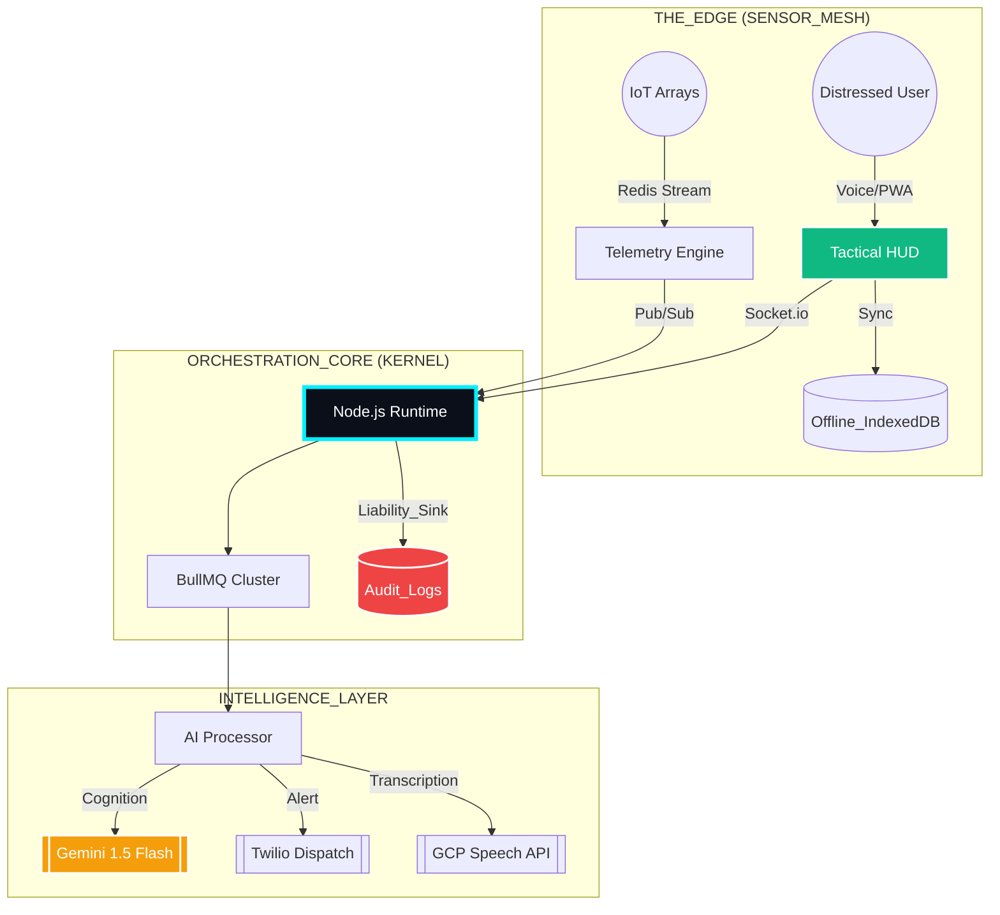

<div align="center">

# 🦚 RAPID CRISIS RESPONSE (RCR)
### **ULTRA-LEVEL AI EMERGENCY ORCHESTRATION KERNEL**
*Next-Gen Resilience for Hospitality & Urban Infrastructure*

<p align="center">
  
</p>

[](https://github.com/Praveen-kumar625/Rapid-Crisis-Response)
[](https://github.com/Praveen-kumar625/Rapid-Crisis-Response)
[](https://github.com/Praveen-kumar625/Rapid-Crisis-Response)
[](https://github.com/Praveen-kumar625/Rapid-Crisis-Response)

[**📡 LIVE_TACTICAL_LINK**](https://rapid-crisis-response-f4yd.vercel.app/) • [**📂 SOURCE_INTEL**](https://github.com/Praveen-kumar625/Rapid-Crisis-Response) • [**🌍 GLOBAL_IMPACT**](./SDG_ALIGNMENT.md) • [**📜 SYSTEM_ADR**](#-deployment-protocols)

</div>

---

## 🌌 THE MISSION DIRECTIVE
In the high-stakes theater of hospitality and urban infrastructure, **seconds determine survival**. Legacy emergency systems are siloed, fragile, and fail when the network dies. 

**RCR v4.0 OMEGA** is an AI-native, offline-first tactical nerve center. It doesn't just report crises—it **orchestrates** them. By fusing Gemini 1.5 Flash intelligence with a decentralized IoT telemetry grid, RCR creates a "Biometric Pulse" of any building, ensuring that even in total blackout, the response never stops.

---

## ⚡ CORE_OPERATIONAL_PIPELINES

<table width="100%">
  <tr>
    <td width="50%" valign="top">
      <h4>🤖 HYBRID_INTELLIGENCE (OMEGA)</h4>
      <p><b>Gemini 1.5 Flash + Edge Heuristics</b>. Real-time crisis classification and triage. Features automated spam filtering and high-fidelity severity detection that functions at the hardware level.</p>
    </td>
    <td width="50%" valign="top">
      <h4>📡 IOT_TELEMETRY_GRID</h4>
      <p><b>Sensor Fusion Engine</b>. Continuous monitoring of Smoke, Thermal, and CO2 levels. Provides a real-time 3D tactical heatmap of building health and hazard progression.</p>
    </td>
  </tr>
  <tr>
    <td width="50%" valign="top">
      <h4>🎙️ MULTILINGUAL_VOICE_SOS</h4>
      <p><b>GCP STT + Neural Translate</b>. High-speed emergency transcription in any language. The system decodes distress signals and dispatches tactical instructions in milliseconds.</p>
    </td>
    <td width="50%" valign="top">
      <h4>🗺️ Z-AXIS_DYNAMIC_ROUTING</h4>
      <p><b>Intelligent Pathfinding</b>. Z-Axis aware navigation (Wing/Floor/Room) that dynamically routes responders and guests away from heat-zones and smoke-filled corridors.</p>
    </td>
  </tr>
</table>

---

## 📋 TACTICAL_COMMAND_CENTER (V4_ENABLED)

RCR has evolved into a full-scale field command engine, implementing "Ultra Level" operational integrity:

*   **[ 🎯 SMART_DISPATCH ]**: AI-decomposed action plans. Tasks are automatically assigned to the optimal responder based on role-matching and floor-level proximity.
*   **[ 💀 DEAD_MANS_SWITCH ]**: Dual-channel redundancy. If a tactical directive isn't acknowledged via WebSocket within 5s, an **Emergency SMS Override** is triggered via Twilio.
*   **[ ⚖️ COMMANDER_ESCALATION ]**: Automated chain-of-command. Unacknowledged critical incidents (Severity 4+) are escalated to the Regional Commander after 180 seconds.
*   **[ 🛡️ AUDIT_INTEGRITY ]**: Every state transition, responder movement, and status change is logged to a liability-grade audit sink for post-incident forensic analysis.

---

## 🏗️ SYSTEM_NEURAL_MAP



---

## 🛠️ TECHNOLOGICAL_FUSION

| STACK_LAYER | COMPONENT_INTEL |
| :--- | :--- |
| **COMMAND_CENTER** |    |
| **NEURAL_BACKBONE** |    |
| **DATA_PERSISTENCE** |    |

---

## 🚀 DEPLOYMENT_PROTOCOLS

### 1. INITIALIZE_DOCKER_GRID
```bash
# Clone and enter directory
git clone https://github.com/Praveen-kumar625/Rapid-Crisis-Response.git
cd Rapid-Crisis-Response/RCR

# Boot entire ecosystem (API + Worker + Web + DB + Redis)
docker-compose up --build -d
```

### 2. KERNEL_CONFIGURATION
Configure `.env` with critical operational credentials:
```env
# AI & CLOUD
GEMINI_API_KEY=your_key
FIREBASE_PROJECT_ID=your_id
TWILIO_AUTH_TOKEN=your_token

# TACTICAL
COMMANDER_PHONE_NUMBER=+1234567890
```

---

<div align="center">

### [ OPERATIONAL_IMPACT_REPORT ]
**⚡ 90% REDUCTION** in triage latency via automated AI cognition.
**🛰️ 100% ACCOUNTABILITY** through real-time responder presence tracking.
**🔋 ZERO_SIGNAL_RESILIENCE** using edge-caching and PWA synchronization.

<p align="center">
  
</p>

**ENGINEERED FOR THE GOOGLE SOLUTION CHALLENGE 2026**

[](https://github.com/Praveen-kumar625)

### JAY SHREE SHYAM 🦚

</div>
