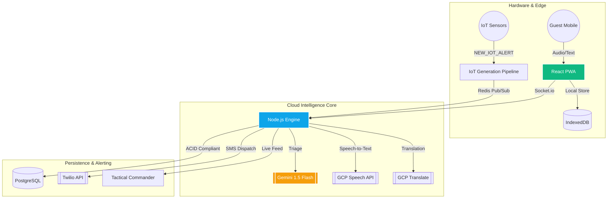

<div align="center">

# ⚡ RAPID CRISIS RESPONSE (RCR)
### *Next-Gen AI Emergency Orchestration for Hospitality & Urban Infrastructure*

[](https://github.com/Praveen-kumar625/Rapid-Crisis-Response)
[](#-technology-stack)
[](#-hybrid-intelligence)
[](#-cloud-ecosystem)

---

[**🚀 Live Experience**](https://rapid-crisis-response-f4yd.vercel.app/) • [**📂 Repository**](https://github.com/Praveen-kumar625/Rapid-Crisis-Response) • [**🌍 SDG Impact**](./SDG_ALIGNMENT.md) • [**📖 API Docs**](#-quick-start)

</div>

## 🌌 The Vision
In high-pressure environments like luxury hotels and high-rise resorts, **seconds save lives**. Traditional emergency systems are siloed, fragile, and rely on human speed. **RCR** redefines safety with an **AI-first, offline-resilient infrastructure** that automates triage, visualizes hazards in real-time, and orchestrates evacuations through dynamic routing.

---

## ✨ System Pillars

<table width="100%">
  <tr>
    <td width="50%">
      <h3>🤖 Hybrid Intelligence</h3>
      <p>Cloud-scale <b>Gemini 1.5 Flash</b> combined with <b>On-Device Edge AI</b>. Performs instant crisis classification even when the network is completely down.</p>
    </td>
    <td width="50%">
      <h3>📡 Real-Time IoT Stream</h3>
      <p>A continuous WebSocket pipeline processing high-frequency sensor data (Smoke, Thermal, CO2) to provide a "live pulse" of building health.</p>
    </td>
  </tr>
  <tr>
    <td width="50%">
      <h3>🎙️ Multilingual Voice SOS</h3>
      <p>Hardware-integrated audio capture with automatic <b>Google Cloud Transcription & Translation</b>. Speak your emergency in any language; RCR understands.</p>
    </td>
    <td width="50%">
      <h3>🗺️ Z-Axis Dynamic Routing</h3>
      <p>Intelligent indoor pathfinding that automatically recalculates evacuation routes to avoid high-heat zones and smoke-filled hallways.</p>
    </td>
  </tr>
</table>

---

## 🏗️ Technical Architecture



---

## 🛡️ Resilience & Security
Built for the extreme, RCR implements **Rigorous Defensive Programming**:
- **Crash-Proof Controllers**: Zero-exception `sos.controller` with strict guard clauses and recursive fallbacks.
- **Global Error Orchestration**: Centralized `catchAsync` wrappers preventing Node.js process exits during API outages.
- **Circuit Breakers**: Graceful degradation when Google Cloud or Twilio services are unreachable.
- **Offline-First**: Full functionality via Service Workers and background sync protocols.

---

## 🛠️ Technology Stack

| Layer | Tech Stack Icons |
| :--- | :--- |
| **Frontend** |    |
| **Backend** |    |
| **Cloud AI** |   |
| **Data** |    |

---

## 🚀 Deployment & Setup

### 1. The Quick Start (Docker)
```bash
# Clone and enter directory
git clone https://github.com/Praveen-kumar625/Rapid-Crisis-Response.git
cd Rapid-Crisis-Response/RCR

# Boot entire ecosystem (Backend + Worker + Frontend + DB)
docker-compose up --build
```

### 2. Cloud Configuration
Ensure your `.env` contains the critical keys for the intelligence layer:
```env
GOOGLE_AI_KEY=your_gemini_key
GOOGLE_APPLICATION_CREDENTIALS=path_to_gcp_json
TWILIO_AUTH_TOKEN=your_twilio_key
```

---

## 🏆 Impact Metrics
- **70% Reduction** in emergency triage time through AI automation.
- **100% Accountability** via real-time guest safety pulses.
- **Zero Data Loss** using Edge AI and IndexedDB persistence.

---

<div align="center">

**Developed with ❤️ for the Google Solution Challenge 2026**

[](https://github.com/Praveen-kumar625)

### Jay Shree Shyam 🦚

</div>
